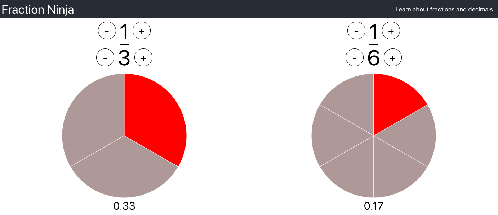
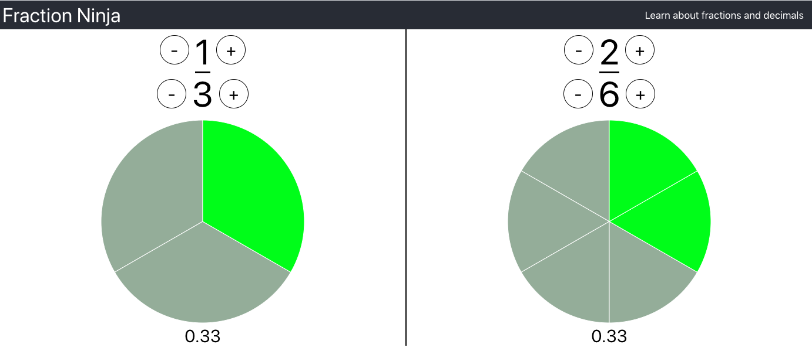
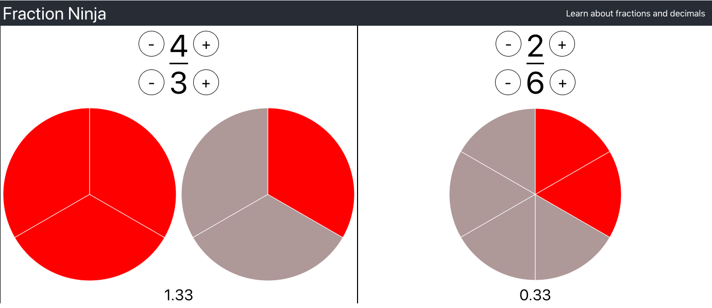

# Fraction.Ninja

This app is designed to help kids understand the equivalence of fractions and decimals. I decided to develop this after creating a mess while trying to do the same thing with oranges 

You can try it here:

[Fraction Ninja Website](https://fraction.ninja)

## Screenshots

### Not Equal

### Equal

### Not Equal

## Technologies demonstrated:

- React
- Typescript
- SASS modules
- D3 Charts
- Flexbox CSS
- Jest
- AWS S3
- AWS Cloudfront
- AWS Cloudformation
- AWS Route 53

## How to run

This project was bootstrapped with [Create React App](https://github.com/facebook/create-react-app). In the project directory, you can run the app in development mode with:

### `yarn start`
 
